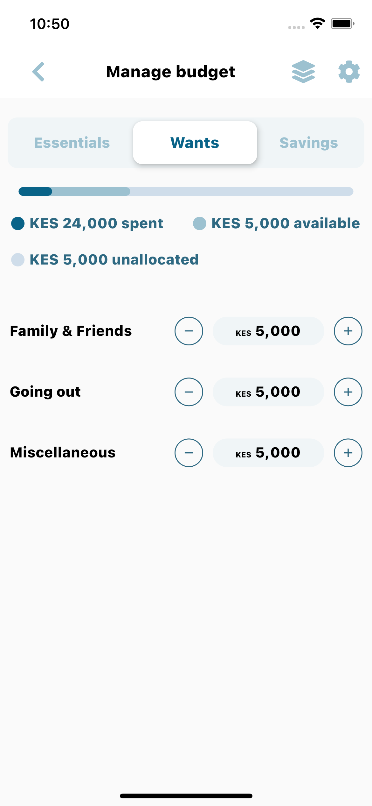

# Alvin App v1: Labrador

Alvin app allows you automatically tracks your expenses and manages a budget for you based on your savings goals.

## Screenshot



## Getting Started

**Step 1:**

Download or clone this repo by using the link below:

```
https://github.com/C3real-kill3r/Alvin_Test.git
```

**Step 2:**

Go to project root and execute the following command in console to get the required dependencies:

```
flutter pub get 
```

**Step 3:**

Run the application(ensure you have an emulator or a phone connected):

```
flutter run
```

## Available Features:

* Home Page UI

### Libraries & Tools Used

* [Font Awesome](https://pub.dev/packages/font_awesome_flutter)

### Folder Structure
Here is the core folder structure which flutter provides.

```
flutter-app/
|- android
|- build
|- ios
|- lib
|- test
|- web
```

Here is the folder structure used in this project

```
lib/
|- components/
|- screenshot/
|- utilities/
|- home.dart
|- main.dart
```

Contens of the lib folder.

``` 
1- components — Contains the common widgets for the applications. For example
Custom Icons Widget.
2- screenshot — Contains all the ui images of the app screens.
3- utilities — Contains the utilities/common functions of the application e.g. constants
4- home.dart — This file contains the UI of the homepage.
5- main.dart - This is the starting point of the application.
```